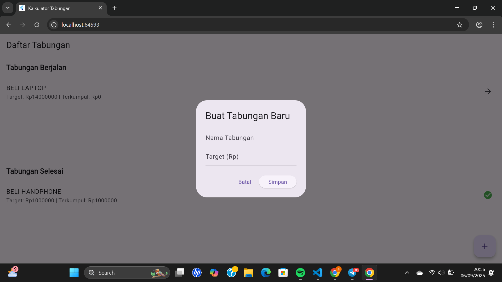

# Aplikasi Tabungan Sederhana 

Aplikasi ini dibuat dengan **Flutter + Provider** untuk membantu mengatur tabungan berdasarkan tujuan (misalnya beli laptop, HP, dll).  
User bisa membuat rencana tabungan, menambah nominal tabungan, dan melihat progress apakah sudah tercapai atau belum.  

---

## Fitur Utama
- **Buat Tabungan Baru** → user dapat menambahkan rencana tabungan baru dengan nama dan target nominal.
- **Lihat Tabungan Berjalan & Selesai** → tabungan dipisah otomatis ke kategori:
  - **Tabungan Berjalan** → target belum tercapai.  
  - **Tabungan Selesai** → target sudah tercapai.  
- **Tambah Nominal Tabungan** → user bisa menambahkan uang ke tabungan tertentu.
- **Progress Tabungan Otomatis** → jika target tercapai, tabungan otomatis masuk ke daftar selesai.
- **Riwayat Menabung** → semua nominal yang ditabung tercatat dalam list.

---

## Tampilan Aplikasi
### Halaman Home
- Menampilkan **daftar tabungan berjalan** dan **tabungan selesai**.  
- Tombol ➕ untuk membuat tabungan baru.  


### Halaman Detail Tabungan
- Menampilkan detail target, jumlah terkumpul, sisa, dan status tercapai/belum.  
- Form input untuk menambah tabungan.  
- Daftar riwayat menabung.  




---

## Teknologi yang Digunakan
- **Flutter** (UI)
- **Provider** (state management)

---

## Cara Menjalankan
1. Clone repository ini:
   ```bash
   git clone https://github.com/audialrsaa/kalkulator_sederhana.git
   cd kalkulator_sederhana
